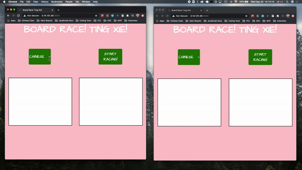

# Board Race! Ting Xie!

  > An online interactive multi-player/single-player handwriting game for anyone practicing a new language

## User Experience

## Press Release
## Summary ##
  > Are you ready to test your memory and handwriting skills? With "Board Race! Ting Xie!", now you can practice your skills in Chinese (or any other language). How quickly can you rember how to spell and/or draw new vocabulary words in your target language? Play alone or against friends to find out and challenge yourself to further growth in your target language!

## Problem ##
  > In many languages, the script is completely different from the Latin alphabet many languages use. For those of us learning a new langauge, learning to write in a new script can be just as tricky as recalling the vocabulary word itself.

## Solution ##
  > With this problem in mind, "Board Race! Ting Xie!" aims to give the user a fun and interactive outlet for practicing both the memory recall and handwriting challenges of learning new foreign language vocabulary. By providing a fun, engaging "gamified" learning platform, you can rest assured that you will improve steadily and have fun at the same time!

## Quote from You ##
  > "From the moment I first challenged my friends to a round of 'Board Race! Ting Xie!', I was hooked. My Chinese is really improving day by day, and so is my confidence!

## How to Get Started ##
  > To get started, just log on to our website for "Board Race! Ting Xie!" and send the invite code to your friend if playing a multiplayer round. Choose your target language, prompt type, difficulty level and number of rounds. You will then be given a prompt in English or PinYin and can begin writing your answer in your target language using your mouse. After the timer finishes, your results will be analyzed and points given based on your performance. Enjoy!

## Customer Quote ##
  > "I've been learning Chinese for several months now, but after COVID-19 kept us all at home in quarantine I really missed seeing my friends. 'Board Race! Ting Xie!' has been the perfect way to stay on top of my Chinese studies while also staying connected to my friends during this difficult time."

## Closing and Call to Action ##
  > For all of you new learners out there, head on over to www.boardrace-tingxie.io now to boot up and start playing in seconds, no log in required!

# For Developers:
 ## Installing:
 > `npm install`

 ## API Keys:
 > 1. Developer must apply for Google Cloud Vision API service key
 >2. Follow set-up instructions from [Google Cloud Vision Docs](https://cloud.google.com/vision/docs/quickstarts)
 >3. Set up according to instructions for Node.js client instead of REST

 ## NPM Scripts:
   `npm run build`

   `npm start`

   ##### (runs app on port 3000)
